<p align="center">
  
</p>
<h1 align="center">Somex — P2P USDT для Кыргызстана</h1>
<p align="center"><b>Люди. Деньги. Возможности.</b><br/>Телефон → WhatsApp-код → KYC → USDT (TRC20) → P2P Optima↔Optima / MBank↔MBank → эскроу → ФИО↔ФИО → подтверждение → USDT</p>

---

Somex — не копия Binance P2P, а более простой продукт под Кыргызстан: P2P + Web3-кошелёк + эскроу + антифрод, где интерфейс **специально не даёт** пользователю легко совершить опасное действие.

| Часть | Стек | Что внутри |
|---|---|---|
| `apps/api` | NestJS 11 · Prisma 6 · PostgreSQL 16 · Redis 7 · socket.io | Auth (WhatsApp OTP через Wappi, только +996), KYC (Didit, 500 бесплатных проверок/мес), двойная бухгалтерия и эскроу, TRON-депозиты и выводы, Risk Engine, ClamAV-сканер файлов, admin API с RBAC и 2FA |
| `apps/mobile` | React 19 · Vite 7 · Tailwind 4 · Framer Motion · PWA | Мобильное приложение 1:1 по дизайну: заставка, вход по номеру, OTP, KYC, главная, фильтры, сделка, защищённое подтверждение оплаты, чат с эскроу-карточкой, отпуск USDT «удерживайте», завершение, профиль, депозит/вывод, безопасность |
| `apps/admin` | React 19 · Vite 7 · Tailwind 4 · Recharts | Control Center: дашборд, пользователи, KYC, AML/депозиты, выводы, кошельки и леджер, P2P, эскроу, споры/арбитраж, Risk Engine, устройства и кластеры, чёрный список, аудит с хэш-цепочкой, поддержка, банки и курс, настройки (SMTP / Wappi / Didit / TronGrid / ClamAV / хранилище) с тестом подключения, администраторы и роли, система |
| `packages/shared` | TypeScript | Банки КР (список и логотипы из экосистемы Finik QR), регионы, маска и валидация +996, правила Risk Engine, лимиты |
| `infra` | Docker Compose · nginx | Postgres, Redis, ClamAV, MinIO, API, оба web-приложения, edge-nginx с TLS, CSP и rate-limit |

## Быстрый старт (локально)

```bash
# 1. зависимости (Node 22+, pnpm 10)
pnpm install

# 2. окружение
cp .env.example .env
# сгенерируйте секреты: openssl rand -hex 32 → MASTER_KEY, JWT_ACCESS_SECRET, JWT_REFRESH_SECRET
# DATABASE_URL / REDIS_URL — локальные Postgres и Redis

# 3. база
pnpm db:migrate        # prisma migrate dev
pnpm db:seed           # банки, правила риска, суперадмин, демо-пользователи и объявления

# 4. запуск (три терминала или pnpm dev)
pnpm dev:api           # http://localhost:4000  (Swagger: /api/docs)
pnpm dev:mobile        # http://localhost:5173
pnpm dev:admin         # http://localhost:5174
```

В режиме разработки (`OTP_DEV_ECHO=true`) код из WhatsApp возвращается в ответе API и показывается на экране кнопкой «DEV: код …». Без ключей Didit KYC работает в **sandbox-режиме** (форма с ФИО и номером документа). `DEV_SIMULATE_CHAIN=true` позволяет эмулировать депозиты из админки (Кошельки → dev) и трансляции выводов.

**Демо-аккаунты** (seed): `+996 555 123 456` — Бекжан Абдыкадыров (баланс 1 250 USDT, PIN `1234`), продавцы `+996 700 111 222` (AltynTrade), `+996 555 777 888` (KGS_Exchange) и др. Админка: `admin@somex.kg` / `ChangeMe!2026` (при первом входе обязательная настройка 2FA; роли compliance/finance/risk/support — те же пароли, поменяйте их).

## Production

```bash
cp .env.example .env   # заполнить все секреты и ключи интеграций
docker compose -f infra/docker-compose.yml up -d --build
```

Сертификаты положите в `infra/nginx/certs/` (`fullchain.pem`, `privkey.pem`); домены `app.somex.kg` и `admin.somex.kg` заданы в `infra/nginx/nginx.conf`. Все интеграции (Wappi, Didit, SMTP, TronGrid, ClamAV, S3) настраиваются также в **Админка → Настройки** без перезапуска — секреты шифруются AES-256-GCM мастер-ключом.

## Документация

- [docs/ARCHITECTURE.md](docs/ARCHITECTURE.md) — модули, потоки данных, состояния сделки, леджер, блокчейн
- [docs/SECURITY.md](docs/SECURITY.md) — модель угроз, антифрод, custody, что нужно для лицензированной модели в КР
- [docs/API.md](docs/API.md) — все эндпоинты пользовательского и админского API
- [docs/ADMIN.md](docs/ADMIN.md) — руководство по Control Center и ролям

## Скрипты

| Команда | Действие |
|---|---|
| `pnpm build` | сборка shared → api → mobile → admin |
| `pnpm typecheck` | `tsc --noEmit` во всех пакетах |
| `pnpm db:migrate` / `pnpm db:deploy` | миграции (dev / prod) |
| `pnpm db:seed` | сид справочников и демо-данных (идемпотентный) |
| `pnpm --filter @somex/api test:e2e` | e2e-тесты API |

## Лицензирование и комплаенс

KYC, AML, эскроу и custody нужно окончательно проектировать под требования лицензированной модели в Кыргызстане (закон «О виртуальных активах», требования ГСРФР/НБКР к идентификации и хранению данных). Один KYC-провайдер не заменяет комплаенс-программу: в проекте предусмотрены ручной ревью, AML-удержания, чёрные списки, аудит и роли — см. `docs/SECURITY.md`.

## Скриншоты

Сняты автоматически Playwright-сценариями (`tools/screenshots`) с реального API: регистрация → KYC → сделка → оплата → отпуск эскроу.

<p>
  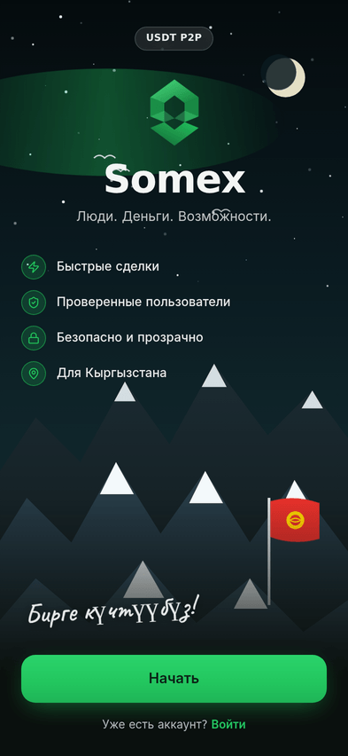
  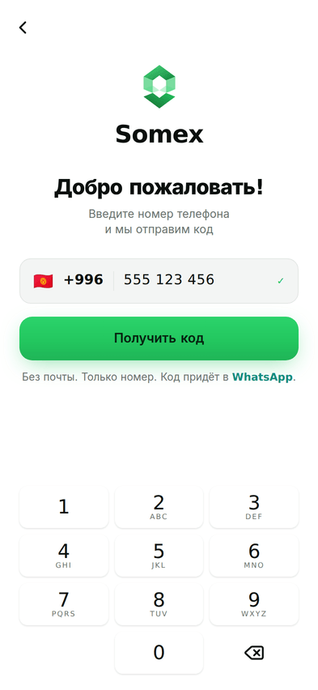
  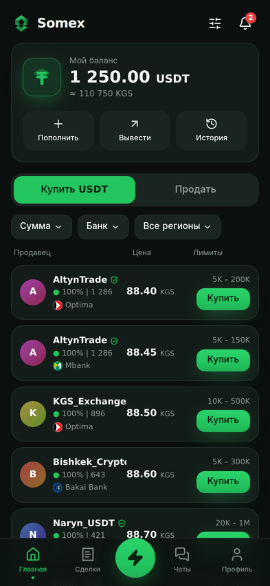
  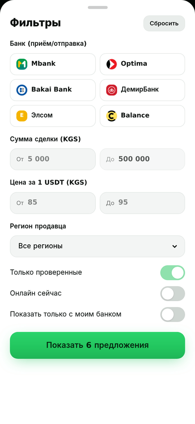
  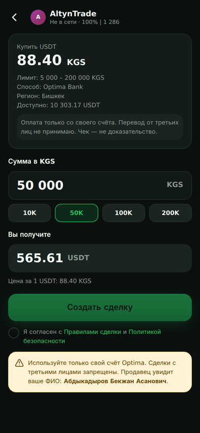
</p>
<p>
  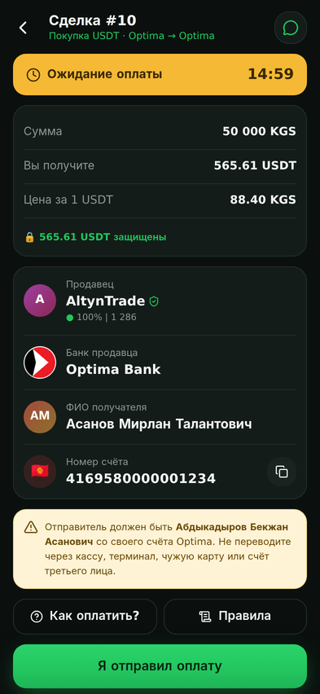
  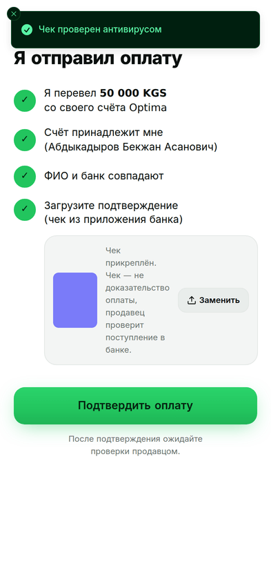
  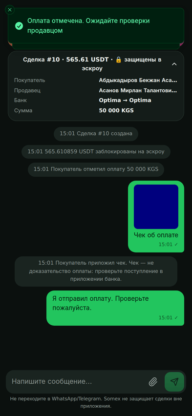
  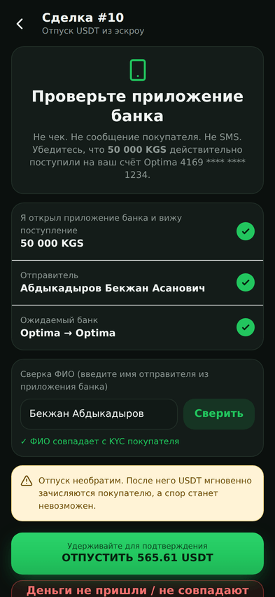
  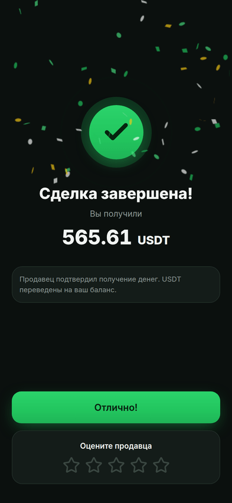
</p>
<p>
  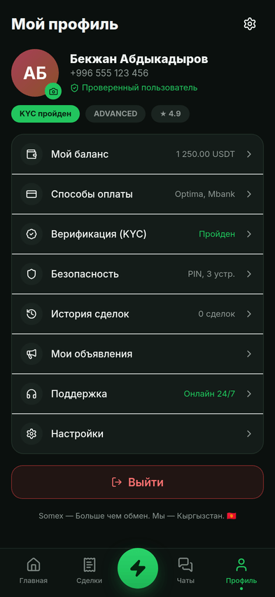
  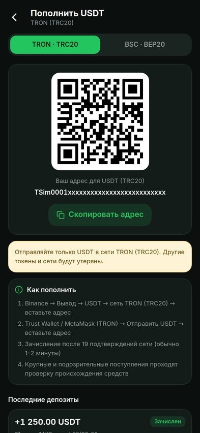
  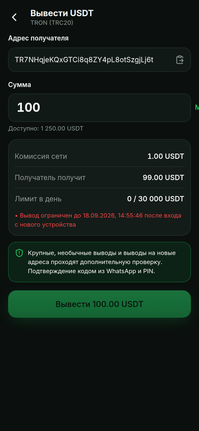
  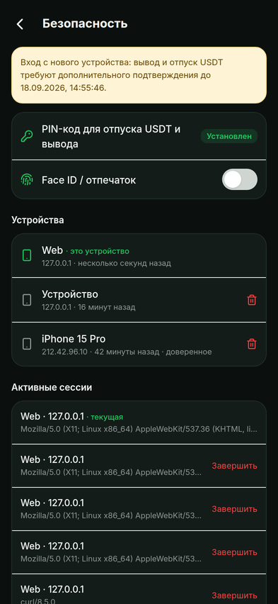
  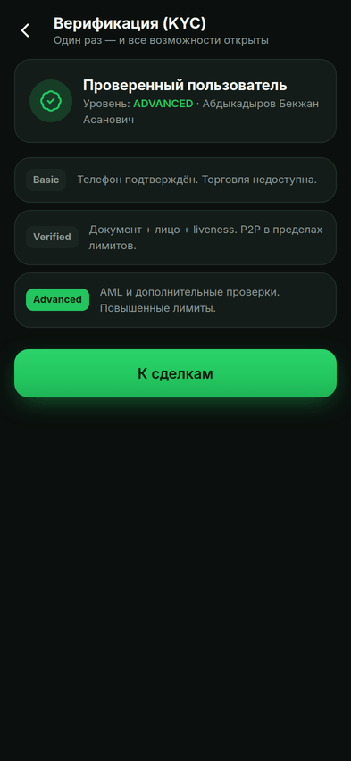
</p>

**Control Center**

<p>
  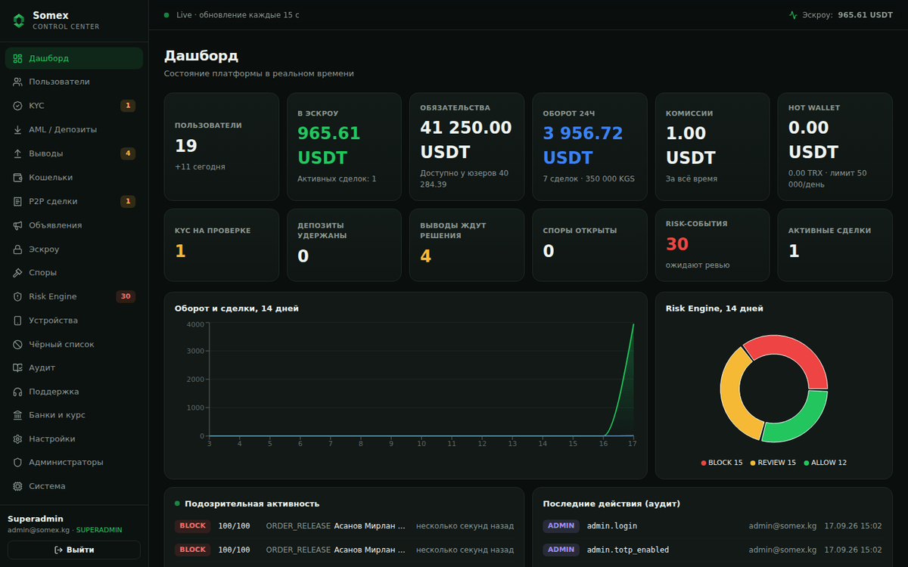
  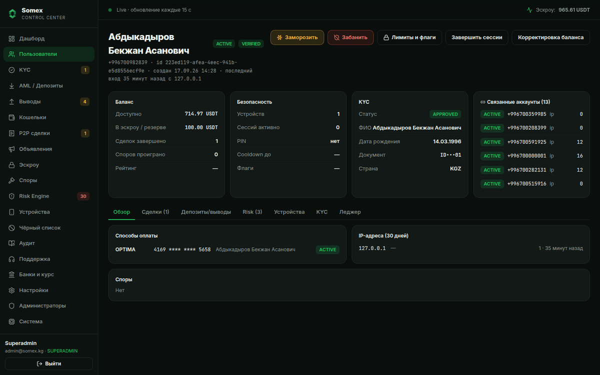
</p>
<p>
  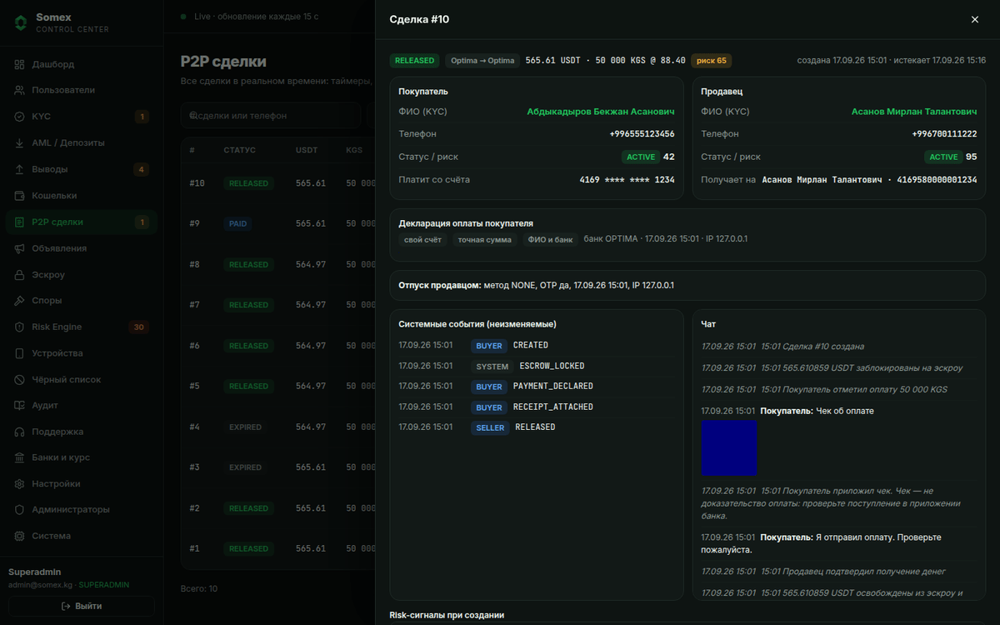
  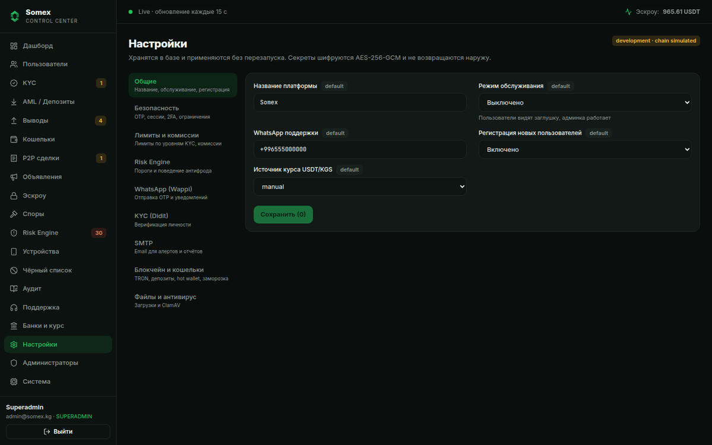
</p>
<p>
  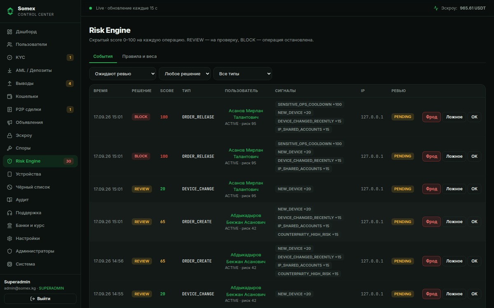
  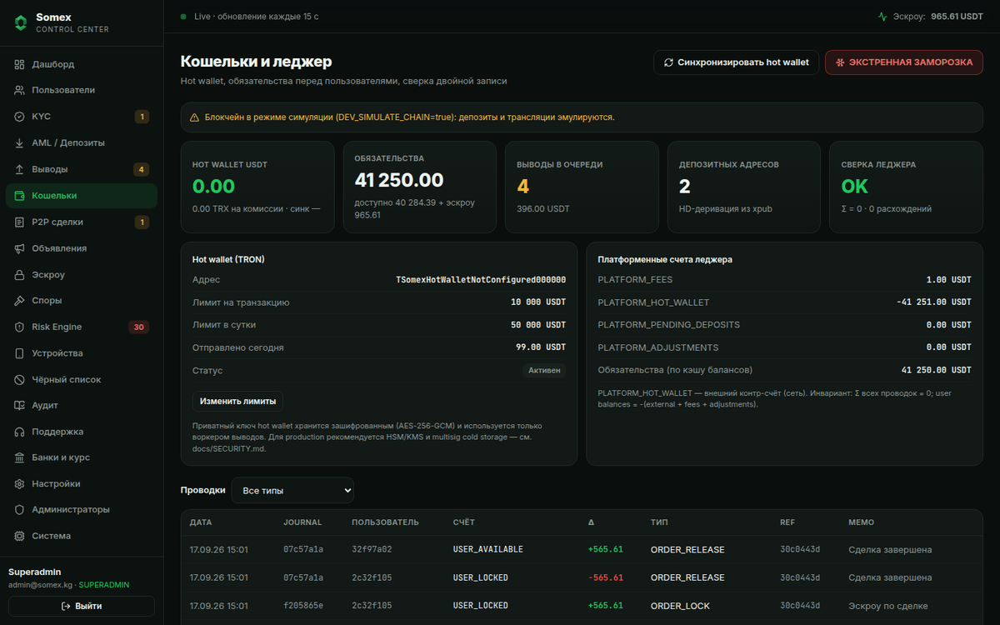
</p>
